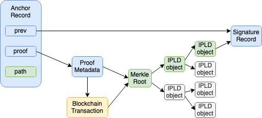

[](https://lbesson.mit-license.org/)
[](https://discord.gg/6VRZpGP)
[](https://twitter.com/ceramicnetwork) 

# Ceramic Protocol Specification

> This repository contains the technical specifications for the Ceramic protocol. It also contains some example applications that can be built on top of it. *For a non-technical introduction to the Ceramic network, see [Ceramic Overview](https://github.com/ceramicnetwork/ceramic/blob/master/OVERVIEW.md).*

## Index

- [Protocol overview](#protocol-overview)
- [Document lifecycle](#document-lifecycle)
  - [Creating a document](#creating-a-document)
  - [Updating a document](#updating-a-document)
  - [Looking up a document](#looking-up-a-document)
- [Document Identifiers](#document-identifiers)
- [Document log](#document-log)
  - [Blockchain anchoring](#blockchain-anchoring)
  - [Conflict resolution](#conflict-resolution)
  - [Document records](#document-records)
- [Document types](#document-types)
  - [Doctypes in Ceramic](#doctypes-in-ceramic)
  - [Update rules](#update-rules)
- [Document update propagation](#document-update-propagation)
  - [Queries](#queries)
  - [Future improvements](#future-improvements)
- [Ceramic Services](#ceramic-services)
  - [Anchor Service](#anchor-service)
  - [Other Services](#other-services)
- [Implementations](#implementations)


## Protocol overview

Ceramic is a decentralized protocol that enables the creation of tamper resistant updatable documents. This is achieved through a combination of digital signatures, specific update rules, and blockchain anchoring. A Ceramic document can be used to represent a self-sovereign identity, a policy for data access control, a verifiable credential, or any agreement between multiple parties. The protocol doesn’t rely on any particular blockchain system, instead it utilizes [IPLD](https://ipld.io) to encode document changes in a hash linked data structure, called a Merkle DAG ([Directed Acyclic Graph](https://en.wikipedia.org/wiki/Directed_acyclic_graph)). Verifying a particular document only requires a user to sync the specific data of the given document. A node in the Ceramic network can thus choose to only *pin* the documents it cares about. This means that there is no global ledger of documents.

A Ceramic document consists of an append-only log where updates are signed then anchored on a blockchain. There are different types of documents (doctypes). Each doctype specifies rules that govern what a valid update to a document looks like, such as signatures and state transitions. This allows Ceramic nodes to verify the state of a given document in a decentralized way. When an update is made to a particular document the nodes in the network gossip about the update and all nodes interested in this update will change the state of the given document. The protocol is agnostic as to which blockchain is used for anchoring and a document could potentially be anchored in multiple chains.

## Document lifecycle

Every document in the Ceramic network is self-contained and the lifecycle of all documents can be broadly described in the same way. There are three main actions that can happen to a document: *create*, *update*, and *lookup*.


### Creating a document

To create a document an IPLD object that contains the initial content of the document is created. This is called the [genesis record](#genesis-record), and its [CID](https://github.com/multiformats/cid) is used as the document identifier (docId). Depending on the document type there might be constraints about what is considered valid content for the genesis record.

### Updating a document

In order to update a document two records need to be added. These updates are added to the [document log](#document-log), which is a linked list of records. First a [signed record](#signed-records) that contains an update to the content is created and added to the log. After the signed record has been created the [CID](https://github.com/multiformats/cid) of this record is sent to an anchoring service that batches a set of document updates into a merkle tree and submits the root hash on a blockchain. The anchoring service then returns an [anchor record](#anchor-records) for the CID which is added to the document log. A complete update to the document has now been made and the node now publishes an update message containing the *docId* and the CID of the anchor record to the [ceramic pubsub topic](#document-update-propagation).

### Looking up a document

To look up a document the *docId* is needed. Once a *docId* is known a node can look up a document by sending a lookup request to the [ceramic pubsub topic](#document-update-propagation). Other nodes that has the state of this document will respond with the latest record CID that they know of. The node making the lookup now resolves the document log of all of the CIDs that it receives (in most cases this will only be one CID). If there are any conflicts they will be resolved by the [conflict resolution mechanism](#conflict-resolution). Once any conflicts are resolved all the updates from the signed records are applied to the genesis record and the latest state of the document is found.

## Document Identifiers

In Ceramic, each document has a unique identifier (docId). This is a persistent identifier of the document that never changes. The identifier is a string with the following format:

```
ceramic://<CID-of-genesis-record>
```

Sometimes Ceramic identifiers might also be formatted as:

```
/ceramic/<CID-of-genesis-record>
```

As an example, a docId might look like this:

```
ceramic://bafyreihl3rizxqjkedmp7rdckrqd3kufwe5e7c6xejcoheqo7rp63idsva
```

### Document versions

Each time a document is [anchored on a blockchain](#blockchain-anchoring) with an *anchor record*, a new version of the document is created. Each version of the document can be referred to by using the following format:

```
ceramic://<CID-of-genesis-record>?version=<CID-of-anchor-record>
```


## Document log

A Ceramic document is made up of an append-only log that can be reduced to a single json object. Each record in the log is an [IPLD](https://ipld.io) object that can be referenced by its [CID](https://github.com/multiformats/cid). Since CIDs are unique identifiers based on the contents of the object we can create a linked list where each record contains a `prev` pointer to the previous entry in the log. This makes the log an immutable history of records. There might however be different branches of a log. To deal with this, a [conflict resolution](#conflict-resolution) strategy that uses blockchain anchoring is used. Each record in the log is of a certain type: genesis, signed, and anchor. The genesis record is the first record of a document. Anchor records anchor a document to a blockchain. Signed records contain updates to the document. The structure of these records is described in the [Document records](#document-records) section below.

### Blockchain anchoring

Document updates are anchored to a blockchain using a merkle tree which is encoded using IPLD. The root of this merkle tree is put on a blockchain, and each leaf of the tree contains a hash of a document update. This means that a large set of document updates can be anchored to a blockchain using only one transaction. Since the merkle tree is encoded using IPLD the witness (merkle proof) for a specific document update can be synced efficiently over the IPFS network. In most cases this anchoring service will be run by a third party that aggregates many updates from many users, but a user may of course choose to anchor their own records if they prefer.

### Conflict resolution

If there are two different branches of the log for a specific document log, the canonical branch is determined by simply looking at the conflicting anchor records to determine which update happened first. When both anchors are on the same blockchain the blockheight of the anchor is used, if the anchors are on different blockchains the block timestamp is used.

It is important to note that an update might have an earlier anchor record but not follow the [update rules](#update-rules) for the given doctype. Therefore conflict resolution is applied after the update rules have been correctly applied. Since all doctypes requires signed updates, a malicious actor would need to get access to the private key(s) of the document creator in order to even create a valid conflicting branch.

#### Data withholding attacks

One suggested attack on this conflict resolution system is a data withholding attack. In this scenario a user creates a document, makes two conflicting updates and anchors one of them earlier than the other, but only publishes the data of the update that was anchored later. Now subsequent updates to the document will be made on top of the second, published update. Every observer will accept these updates as valid since they have not seen the first update. However if the user later publishes the data of the earlier update all of the other updates made to the document will be invalidated.

This is essentially a *double spend attack* which is the problem that blockchains solve. However since identities have only one owner, the user, this is less of a problem. In this case, a "double spend" would cause the user to lose all history and associations that have accrued on their identity, which they are naturally disincentivized to do. Similarly for tile documents signed by multiple parties, since all parties need to sign all updates they all would need to all be aware of the data withholding attack.

In the case of organizational identities this is more of a problem, e.g. if an old admin of the org wants to cause trouble. This can be solved by introducing "heavy anchors" which rely more heavily on some on-chain mechanism. For example, a smart contract or a DAO that controls the identity.

#### Two anchors same blockheight

It is technically possible, though unlikely, that two document updates get anchored with the same blockheight. If this happens the protocol simply chooses the update record which has the smallest CID in binary format.

### Document records

Records act as the fundamental building block for Ceramic documents. A record is an IPLD object that contains some data and a proof for that data. Each record type provides a method for verifying its proofs. A proof can have many forms but the most common examples are signatures and blockchain anchors. Below the most common record types are defined with the expected data format described using [IPLD Schema](https://specs.ipld.io/schemas/).

#### Genesis record

The genesis record is the first record of the document. The CID of this record is used to create the persistent `DocId` of the document, which is an immutable permalink used to identify the particular document. The schema outlined below describes the geneal form of genesis records for any doctype. It has three main properties, `doctype`, `header`, and `data`. The *doctype* is a string which describes the doctype of this document. *header* is a property that includes additional metadata about the document. Finally the *data* property contains the content of the document at the time of creation.

```ipldsch
type GenesisHeader struct {
  owners [String]
  schema optional String
  tags optional [String]
  unique optional String
}

type GenesisRecord struct {
  doctype String
  header GenesisHeader
  data Any
}
```

The required properties that need to be defined by all doctypes.  However it's up to the specific doctype how to use the data within.

- `doctype` - a string that contains the name of the given doctype
- `owners` - an array of strings that defines the owners of the document
- `data` - the data that is used to generate the content of this document

There are a few optional properties above that have special uses in the Ceramic protocol.

- `schema` - a string that should represent a Ceramic DocId of a document which contains a schema. It's up to the specific doctype to use the schema to validate the document content
- `tags` - an array of strings that can be used to  categorize the given document. Anchor and Indexing services in the  Ceramic network will use this property if present
- `unique` - if present should contain a random string that allows the document to get a unique DocId even if it has the exact same content as another document

#### Signed records

A **signed record** allows a document to be updated. It either contains a signed proof (e.g. `address-link`) or is wrapped in one (e.g. doctypes using [dag-jose](https://github.com/oed/js-dag-jose)). Signed records contain a pointer to the previous record as `prev`, an update to the document as `data`, and the encoded signature. The way in which signatures are verified depend on which doctype is being used.

```ipldsch
type SignedHeader struct {
  owners optional [String]
  schema optional String
  tags optional [String]
}

type SignedRecord struct {
  id Link
  prev Link
  refs [Link]
  header optional SignedHeader
  data Any
}
```

The required properties that need to be defined by all signed records:

- `id` - an IPLD link to the Genesis record
- `prev` - an IPLD link to the previous record
- `refs` - an array of IPLD links (see [Reference links](#reference-links)) 
- `data` - the data that is used to update the content of the document, e.g. a patch object

The three optional properties in the header serve specific purposes:

- `owners` - should be included to update the owners of the document, e.g. key rotation
- `schema` - should be included to update the schema that is used by the document
- `tags` - should be included to update the tags for the document

#### Anchor records

An anchor record is simply a proof that the CID of the `prev` property was anchored on a blockchain. The format of this record can be seen below. The `proof` property contains the CID of the AnchorProof. This proof metadata object is shared by all document updates that were anchored in the same merkle tree on the same blockchain. The `path` is the unique path to the leaf of the merkle tree that contains the CID that is also in the `prev` property.

##### Anchor record:

```ipldsch
type MerkleNode struct {
  L Link
  R Link
}

type AnchorProof struct {
  chainId String
  blockNumber Int
  blockTimestamp Int
  txHash Link
  root Link
}

type AnchorRecord struct {
  id Link
  prev Link
  refs [Link]
  proof &AnchorProof
  path String
}
```

In addition to `id`, `prev`, and `refs` which where defined above, we have the following properties:

- `chainId` - a [CAIP-2](https://github.com/ChainAgnostic/CAIPs/blob/master/CAIPs/caip-2.md) string representing a specific blockchain
- `blockNumber` - the number of the block in which the transaction was included
- `blockTimestamp` - the timestamp in the block in which the transaction was included
- `txHash` - a CID of a blockchain transaction, e.g. [eth-tx](https://github.com/ipld/js-ipld-ethereum/)
- `root` - an IPLD link to a MerkleNode
- `path` - a string representing the path from `root` to the SignedRecord also referenced by `prev`

Note that the `blockNumber` and `blockTimestamp` are added to this object for convenience, but these numbers need to be verified. The `txHash` contains the CID of the blockchain transaction in which the root CID was included. Using this tx hash an external blockchain api can be used to validate the information of the proof. Finally the `root` property contains the CID of the root of the IPLD merkle tree.

Below a graphical representation of an Anchor Record as well as it's path in the merkle tree that contains its proof is depicted. Both the *Merkle Root* and *IPLD object* are represented by a *MerkleNode* as defined above.



To verify a specific anchor record the following algorithm:

1. Get the proof metadata object from ipfs using the proof CID
2. Get all the data starting from `root` and follow all links in the `path`
3. Verify that the end of the path is the same as `prev`
4. Get the transaction data from the given blockchain using `txHash`
5. Verify that `blockNumber` and `blockTimestamp` are correct

A nice property of storing the anchor proof and the merkle tree using IPLD is that documents that share the same proof object and have similar paths in the merkle tree will end up collaboratively storing parts of the data of their proofs.

#### Additional record types

In the future there might be new record types defined by additional [CIPs](https://github.com/ceramicnetwork/CIP). These may include things like DAO records which in theory could  act as both an anchor and a signature record. If a new record type is  defined it needs to get explicit support in each Doctype.

#### Reference links

The `refs` property in the signed and anchor records contain a list of records that make up this document. It's used as a way to speed up the syncing process of a document log. In order to achieve this the `refs` property points to a set of previous records based on their logarithmic distance from the current node. See the [ipfs-log source](https://github.com/orbitdb/ipfs-log/blob/master/src/log.js#L268-L280) for reference of how this can be implemented.

## Document types

Every Ceramic document has to specify a document type (doctype). The doctype describes the rules that are applied to the update function of a document and the format of the data in the document.

### Doctypes in Ceramic

There are currently three main doctypes specified by Ceramic, but more can be added in the future if needed.

- [3id](./doctypes/3id.md) - Self-sovereign identities using the DID standard
- [tile](./doctypes/tile.md) - Tile documents used to describe services, schemas, metadata, access control, etc.
- [account-link](./doctypes/account-link.md) - Links from blockchain addresses to DIDs

### Update rules

Each doctype needs to specify rules for what constitutes valid updates and valid sequences of log records. For example, the *3id* doctype only allows the user to add or remove document properties if the records are signed by the *management key* of the 3id, while the *tile* doctype is more flexible and might require signatures from multiple parties. The doctype may also specify the required data format for the content of the given document. For example, the *account-link* doctype only allows one DID as its content.

## Document update propagation

Given a docId (e.g. `/ceramic/3id/<CID>`) the full log can be retrieved by communicating with other nodes in the ceramic network. This is achieved using [libp2p pubsub](https://github.com/libp2p/specs/tree/master/pubsub) to share the updates to a document log among peers. All nodes in the Ceramic network joins the `/ceramic` pubsub topic. When a node makes a change to a document the new head (most recent record CID) is shared over the pubsub topic along with the docId. Peers that are interested in this document see this message, fetch the new records using IPFS and apply the log to the document. If a node gets two or more conflicting heads the [conflict resolution mechanism](#conflict-resolution) is used.

**Update message format:**

```js
{
  typ: 0,
  id: <docId>,
  cid: <head-CID>
}
```

### Queries

A node can also query other nodes for the latest head of a particular document. To do this they send a `REQUEST` message to the pubsub topic. Other peers that see this message will respond with a document `RESPONSE` message.

**Request message format:**

```js
{
  typ: 1,
  id: <docId>
}
```

If a node that has been offline comes back online it will have to make a request for all the documents it's interested in to make sure it has all the latest updates.

### Anchor metadata messages

When a node request an anchor from an anchor service it will recieve metadata about when the service intends to anchor the document update on a blockchain. However, other nodes interested in the same document will be unaware of this extra metadata information. In order to share this info with other node the `ANCHOR_META` message is used to tell other nodes that a request has been made to a specific anchor service. The interested peers can then query the given anchor service to retrieve the metadata information.

### Message types

| name        | typ  | params                                                       |
| ----------- | ---- | ------------------------------------------------------------ |
| UPDATE      | 0    | id: `docId`, cid: `head-CID`                                 |
| REQUEST     | 1    | id: `docId`                                                  |
| RESPONSE    | 2    | id: `docId`, cid: `head-CID`                                 |
| ANCHOR_META | 3    | id: `docId`, cid: `head-CID`,<br />anchor-service-url: `url-of-service` |


### Future improvements

The main reason for having one pubsub topic that all documents are shared within is to more easily create a well connected network. The benefit of this is that you can get updates from nodes interested in the same document, even if not directly connected to them. The main drawback of this approach is scalability. Once the network grows the amount of documents and messages in the pubsub topic will be to large for many nodes. In order to deal with this the documents can be split into multiple different rooms using some form of namespace-ing based on *docId*. Exactly how this looks like is not yet determined.

A potential problem with the pubsub approach is some form of DoS. When a node makes a request for a specific document a malicious actor could send a lot of heads that do not correspond to the requested document. This would result in the requesting node having to do a lot of computation to make sure all of the received heads are in fact not correct. There are a few different way to solve this. One is to use a tit-for-tat system where nodes disconnect from nodes that send many incorrect responses. If many users do this it should effectively block malicious nodes as they start performing an attack. A different approach is to include a zero-knowledge proof in the response that proves that the CID in the message indeed does correspond to the correct document.

## Ceramic services

The `tile` doctype can be used to describe services that are made available though through the Ceramic network. A service provider creates a tile document that includes the description of the api that can be used to reach the service (e.g. http api, libp2p protocol, etc). The tile document may also include payment information, i.e. if some form of payment is needed in order to use the service. Ceramic enables many types of services, but the main focus of this document is the *anchor service* which is required for a ceramic node to be able to make updates a document. Please see the Ceramic [Use Cases](https://github.com/ceramicnetwork/ceramic/blob/master/OVERVIEW.md#open-web-services) for descriptions of other services.

### Anchor service

As mentioned in the [Blockchain anchoring](#blockchain-anchoring) section there is a need for a blockchain anchoring service that alleviates the need for users to make a blockchain transaction for each of their document updates. Instead a ceramic node can rely on an anchoring service that receives anchor requests and on a regular interval batches these requests into a single transaction. This service can be run by anyone, and it's possible to configure which anchoring service to use in the ceramic node by specifying a [Service Policy tile](./doctypes/tile.md#service-policy) in the configuration file. Different services might offer anchors to different blockchains and depending on the context one blockchain might be preferred to another.

### Other services

Using Ceramic [Service Policy tiles](./doctypes/tile.md#service-policy) almost any type of services can be represented. Some examples of this include Payments, Data hosting, Indexing, etc. Adding a service to ceramic allows it to be used in a user centric way. Services can be enabled per user and apps can route to different services though the users identity.

## Implementations

Currently there is a partial Typescript ([js-ceramic](https://github.com/ceramicnetwork/js-ceramic)) reference implementation available. If you're interested in contributing an implementation in another language [please reach out](mailto:core@ceramic.network) and we'll help you get started!


## Continue

### [Ceramic JavaScript Client  >](https://github.com/ceramicnetwork/js-ceramic)

