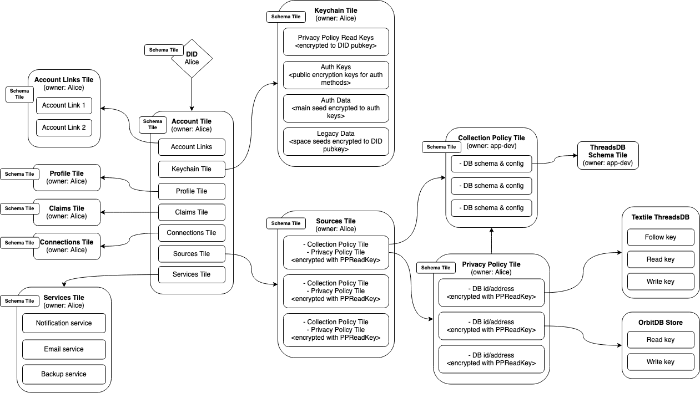

# Account Template

> The account temple provides a structured and flexible way to represent a user and their information in Ceramic. This template is constructs a set of tile documents that represent different aspects of a users account, such as data sources, public profile, associated services, etc. Together they enable a user centric data and service routing system.




## Overview

The Ceramic account template is a data structure that represents a user. It uses different tiles to keep track of various categories of data associated with the user. The five main categories are: **Account Links** Which keeps track of all the [account-links](./doctypes/account-link.md) that map to the users DID. The **Keychain** which keeps track of data that allows users to authenticate to their DID. Each account can have a **Profile** which contains public information about the account. **Services** describes the prefered services that the user can configure for the account, for example how to send them a message. Finally **Sources** describe different databases that is associated to the users account. These five categories are all described as Ceramic tiles and the **Account tile** contains pointers to these specific tiles. The users DID contains a link to this account tile. All of these tiles have a defined schema, most of which are defined below. 

In the above graphic we can see that all tiles are owned and created by the user *Alice*, with the exception of the **Collection Policy**. Instead the **Collection Policy** is a tile that is created by an application developer to describe the data of their application. This means that there is only one **Collection policy** for all the user of an app. From the account perspective the **Sources** tile contains an array of encrypted tuples of **Collection policies** and **Privacy policies**. The Privacy policy contains the id/address of particular database instances that are controlled by the given user, while the **Collection Policy** contains information about the schema and configuration of these databases. This abstraction allows users data to remain encrypted and private while app developers can browse available data from existing applications by looking at **Collection policies** that are availible in the Ceramic network. As an example in the graphic above there is a **ThreadsDB Schema tile** which describes the schema used by a [*Textile ThreadsDB*](https://github.com/textileio/js-threads) instance.

## Tile definitions

The various user account tiles can be found below. Each have a short description along with their schema and simple examples. 

### Account Tile

The Account Tile simply contains mappings to the docIds of the other tiles to which it maps.

##### Schema

```json
{
  "$schema": "http://json-schema.org/draft-06/schema#",
  "$ref": "#/definitions/Account",
  "definitions": {
    "Account": {
      "type": "object",
      "additionalProperties": false,
      "properties": {
        "account-links": {
          "type": "string",
          "pattern": "^ceramic:\/\/.+"
        },
        "profile": {
          "type": "string",
          "pattern": "^ceramic:\/\/.+"
        },
        "sources": {
          "type": "string",
          "pattern": "^ceramic:\/\/.+"
        },
        "services": {
          "type": "string",
          "pattern": "^ceramic:\/\/.+"
        },
        "keychain": {
          "type": "string",
          "pattern": "^ceramic:\/\/.+"
        }
      },
      "title": "Account"
    }
  }
}
```

##### Example

```json
{
  "account-links": "ceramic://bafyljsdf1",
  "profile": "ceramic://bafysdfoijwe1",
  "sources": "ceramic://bafysdfoijwe2",
  "services": "ceramic://bafysdfoijwe3",
  "keychain": "ceramic://bafysdfoijwe4"
}
```


### Account Links Tile

The account links tile is simply an array of docIds for [account-links](./doctypes/account-link.md) that link to the users DID.

##### Schema

```json
{
    "$schema": "http://json-schema.org/draft-06/schema#",
    "type": "array",
    "items": {
        "type": "string",
        "pattern": "^ceramic:\/\/.+"
    },
    "definitions": {}
}
```

##### Example

```json
["ceramic://bafyljsdf1", "ceramic://bafyljsdf2"]
```


### Claims Tile

The claims tile contains a list of claims issued by third party services about the user. For example this could include social verifications for twitter, discord, and discourse. 

##### Schema

```json
{
    "$schema": "http://json-schema.org/draft-06/schema#",
    "type": "array",
    "items": {
        "type": "string"
    },
    "definitions": {}
}
```

##### Example

```jsonc
[<JWT>, <JWT>]
```


### Connections Tile

The connection tile contains a list of DIDs that the user is following.

##### Schema

```json
{
    "$schema": "http://json-schema.org/draft-06/schema#",
    "type": "array",
    "items": {
        "type": "string"
    },
    "definitions": {}
}
```

##### Example

```jsonc
["did:3:bafy1...", "did:3:bafy2..."]
```


### Keychain Tile

Contained in the Keychain tile is data needed for authentication and selective disclosure of data. **Privacy Policy Read Keys** are symmetric keys that are used to encrypt data about Privacy Policies. These keys are stored encrypted to the public encryption key of the users DID. **Auth Public Keys** are public encryption keys (using the `x25519` curve) that can be used to authenticate to the DID of the user. **Auth Data** contains the seed used to derive the DID keys, but encrypted to each of the *Auth Public Keys*. **Legacy Data** contains data encrypted to the public encryption key of the DID that is needed for backwards compatibility.

```json
{
    "$schema": "http://json-schema.org/draft-06/schema#",
    "$ref": "#/definitions/Keychain",
    "definitions": {
        "KeychainTile": {
            "type": "object",
            "additionalProperties": false,
            "properties": {
                "privacy-policy-read-keys": {
                    "type": "array",
                    "items": {
                        "type": "string"
                    }
                },
                "auth-public-keys": {
                    "type": "array",
                    "items": {
                        "type": "string"
                    }
                },
                "auth-data": {
                    "type": "array",
                    "items": {
                        "type": "string"
                    }
                },
                "legacy-data": {
                    "type": "array",
                    "items": {
                        "type": "string"
                    }
                }
            },
            "title": "Keychain"
        }
    }
}
```

##### Example

```jsonc
{
    "privacy-policy-read-keys": [<JWE>],
    "auth-public-keys": [<multicodec-x25519-public-key>],
    "auth-data": [<JWE>],
    "legacy-data": [<JWE>]
}
```


### Sources Tile

The sources tile contains a list of data sources that the user has. Each entry is encrypted using a unique *Privacy Policy Read Key*. This allows specific data sources to be selectively disclosed. Each entry, when decrypted, contains two Ceramic docIds, one for the collection policy and one for the privacy policy.

##### Schema

```json
{
    "$schema": "http://json-schema.org/draft-06/schema#",
    "type": "array",
    "items": {
        "type": "string"
    }
}
```

##### Example

```jsonc
["<JWE>", "<JWE>"]
```

##### Decrypted entry example

```json
{
  "collection-policy": "ceramic://bafy123",
  "privacy-policy": "ceramic://bafy234"
}
```


### Privacy Policy Tile

The Privacy Policy tile contains encrypted information about the users data. All of the data is encrypted using the specific **Privacy Policy Read Key** of this policy. The **collection-policy** property contains a docId of the **Collection Policy** this **Privacy Policy** applies to. The **service-policies** property contains an array of docIds of the services that back up the data defined in this privacy policy. All applicaitons which have been granted rights to this Collection are listed in the **applications** arrayMost importantly the **references** property holds an array of entries which when decrypted contains information about the database used to store the users information.

##### Schema

```json
{
    "$schema": "http://json-schema.org/draft-06/schema#",
    "$ref": "#/definitions/PrivacyPolicy",
    "definitions": {
        "PrivacyPolicy": {
            "type": "object",
            "additionalProperties": false,
            "properties": {
                "collection-policy": {
                    "type": "string"
                },
                "service-policis": {
                    "type": "array",
                    "items": {
                        "type": "string"
                    }
                },
                "applications": {
                    "type": "array",
                    "items": {
                        "type": "string"
                    }
                },
                "references": {
                    "type": "array",
                    "items": {
                        "type": "string"
                    }
                }
            },
            "required": [
                "collection-policy",
                "references",
            ],
            "title": "PrivacyPolicy"
        }
    }
}
```

##### Example

```jsonc
{
    "collection-policy": "<JWE>",
    "service-policies": ["<JWE>"],
    "applications": ["<JWE>"],
    "references": ["<JWE>", "<JWE>"]
}
```

##### Decrypted references examples

```json
{
  "id": "my-orbitdb-definition",
  "orbit-db-address": "/orbitdb/abcd..."
}
```

```json
{
  "id": "my-textile-thread-definition",
  "thread-id": "<textile thread ID>"
}
```


### Collection Policy Tile

In contrast to all of the tiles described above, the **Collection Policy** is created by a developer to describe the data format that is contained in users **Privacy Policies**. This means that there is only one unique collection policy for many users privacy policies. This abstraction allows applications to share information about the data they are storing with their users, without compromising on the privacy of any given user. Currently the collection policy supports describing Textile and OrbitDB databases, but this can easily be extended to other distributed database systems as well.

##### Schema

```json
{
    "$schema": "http://json-schema.org/draft-07/schema#",
    "$ref": "#/definitions/CollectionPolicy",
    "definitions": {
        "TextileCollection": {
            "title": "TextileCollection",
            "type": "object",
            "properties": {
                "schema": {
                    "type": "string",
                    "title": "schema",
                    "pattern": "^ceramic:\/\/.+"
                }
            },
            "required": [
                "schema"
            ]
        },
        "Textile": {
            "title": "Textile",
            "type": "object",
            "properties": {
                "type": {
                    "type": "string",
                    "enum": [
                        "Textile"
                    ],
                    "title": "type"
                },
                "collections": {
                    "type": "object",
                    "additionalProperties": {
                        "$ref": "#/definitions/TextileCollection"
                    },
                    "title": "collections"
                }
            },
            "required": [
                "collections",
                "type"
            ]
        },
        "OrbitDB": {
            "title": "OrbitDB",
            "type": "object",
            "properties": {
                "type": {
                    "type": "string",
                    "enum": [
                        "OrbitDB"
                    ],
                    "title": "type"
                },
                "storeType": {
                    "type": "string",
                    "title": "storeType"
                },
                "accessController": {
                    "type": "object",
                    "properties": {
                        "type": {
                            "type": "string",
                            "title": "type"
                        },
                        "skipManifest": {
                            "type": "boolean",
                            "title": "skipManifest"
                        }
                    },
                    "required": [
                        "type"
                    ],
                    "title": "accessController"
                }
            },
            "required": [
                "accessController",
                "storeType",
                "type"
            ]
        },
        "CollectionPolicy": {
            "title": "CollectionPolicy",
            "type": "object",
            "additionalProperties": {
                "anyOf": [
                    {
                        "$ref": "#/definitions/Textile"
                    },
                    {
                        "$ref": "#/definitions/OrbitDB"
                    }
                ]
            }
        }
    }
}
```

##### Example

```json
{
    "my-textile-thread-definition": {
        "type": "Textile",
        "collections": {
            "set1": {
                "schema": "ceramic://bafyaasdf"
            }
        }
    },
    "my-orbitdb-definition": {
        "type": "OrbitDB",
        "storeType": "keyvalue",
        "accessController": {
            "type": "legacy-ipfs-3box",
            "skipManifest": true
        }
    }
}
```

